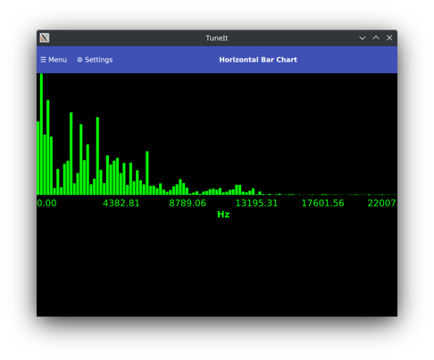
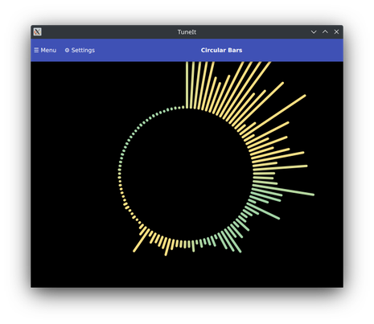
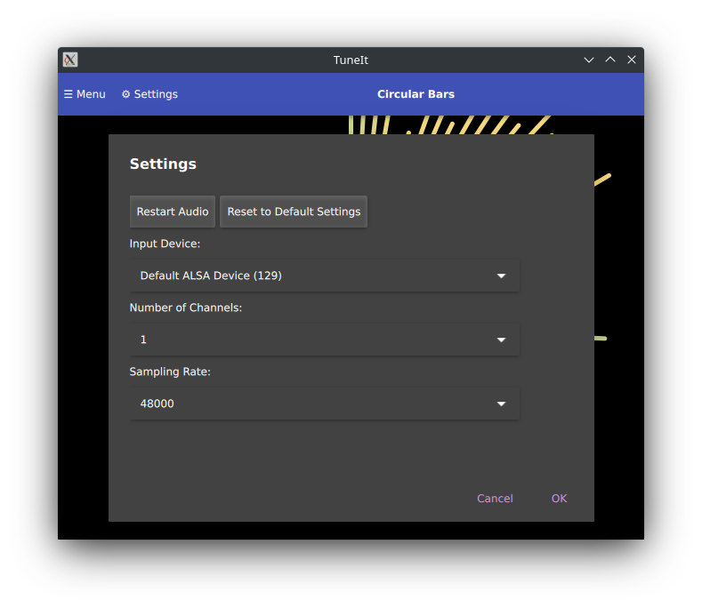

## TuneIt
An app for visualizing frequencies in audio input sources in various ways. This project is in it's early stages with much more features to add.

Please provide feedback through issue tickets.

## Screenshots

## FAQ
*Why combine the sources for FFTW3 and other libraries, instead of building and linking against their products seperately?*

- It's to ensure a portable code-base, and the compiler is better at eliminating redundant code.

*Why did you build this?*
- To prove the graphics capabilities of the QML engine, and found Qt's additions to C++ made development easier and possible. 
- To experiment with different ways of visualizing pitch, starting from my inspiration with the circular bars.

*Why use Qt?*
 - Through experimentation, I found I could use low-level API's, IE, using NanoVG or Dear IMGUI that uses OpenGLES and could allow a common code base, for rendering at least, between GNU Linux and Android, but this is time consuming and difficult.
 - I don't mind releasing the source code for my software, as I care more about proving technological capabilities and delivering value to people first.
 - No other libraries for C++ are as feature complete and widely usable.

## Cloning
I recommend doing a shallow clone with `--depth 1`, because there
was a lot of IDE related junk from my earlier commits.

## Building
I recommend using Qt Creator, as it sorts out the settings necessary for building the app on your host machine. 

You'll need to pass these extra options to CMake to set the paths to FFTW3, and Oboe (Android Audio I/O library by Google).

Download a source archive for FFTW3 from http://fftw.org/download.html.

After downloading and extracting FFTW3 and Oboe, run CMake with this command line:

`
cmake -B<build_dir> -GNinja -DCMAKE_PREFIX_PATH=<path_to_qt6> -DFFTW3_ROOT_DIR=<path_to_fftw3>
`

### Platform specific notes
#### Windows 10
Please refer to build-windows-msvc19.txt for building the app statically with MSVC19. You need to force CMake to use release build mode, and thereby cause MSVC to link against the correct runtime library.

You'll need to download a different file archive for Windows, namely the 64bit DLL's from http://fftw.org/install/windows.html, and then use the extracted path for the option `FFTW3_ROOT_DIR`.

